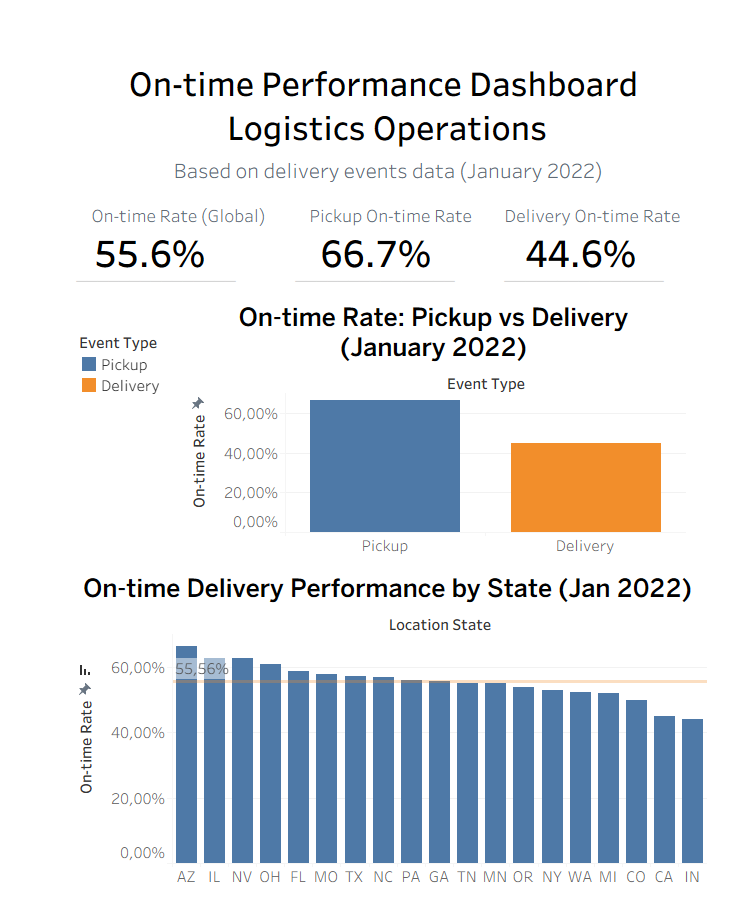
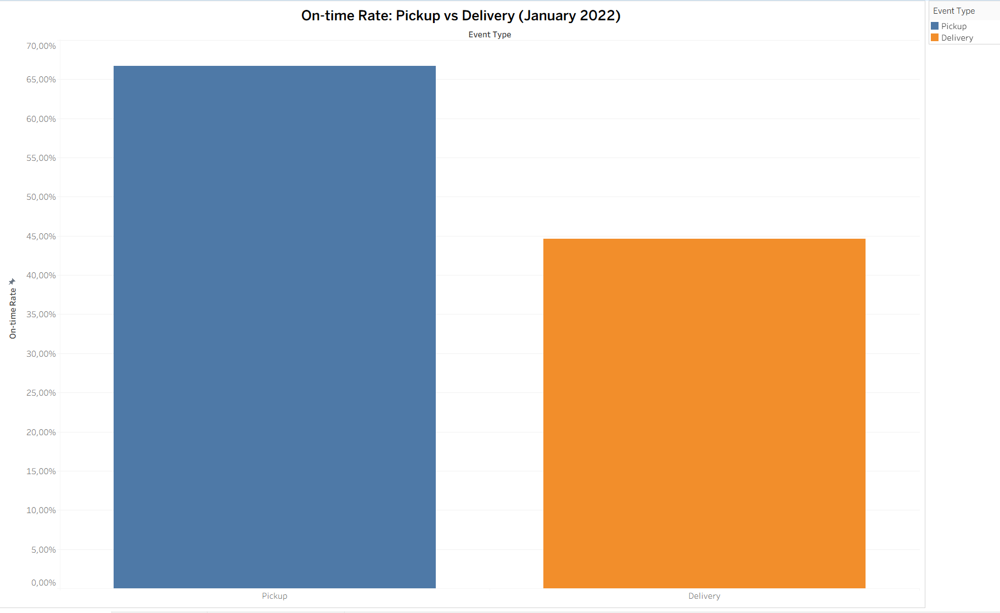
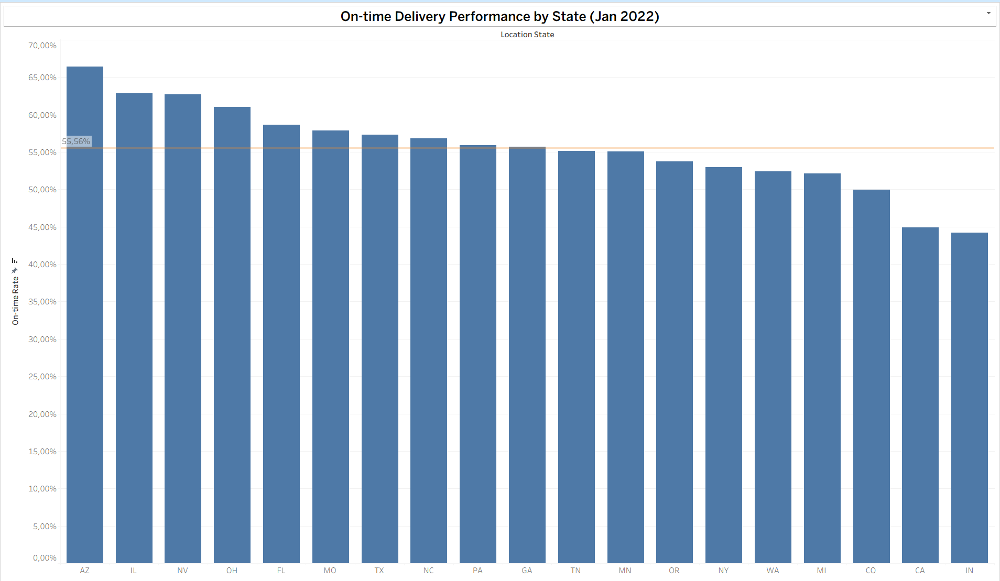

# On-time Performance Dashboard – Logistics Operations

## Project Overview
This project analyzes on-time delivery performance in logistics operations to identify delays, patterns, and operational inefficiencies.

## Business Objective
Evaluate delivery punctuality and support data-driven decisions to improve logistics performance and operational reliability.

## Dataset Context
- Delivery events data for **January 2022**
- Includes pickup and delivery events
- Multiple locations (state-level analysis)
- Large operational dataset representing real logistics workflows

## Key KPIs
- On-time delivery rate (%)
- Pickup vs delivery on-time performance
- Delay trends over time
- Performance comparison by location (state)
- Planned vs actual delivery outcomes

## Tools Used
- **Google Sheets** – data cleaning and preparation  
- **Tableau** – KPI calculation, visualization, and dashboard design

## Key Insights
- Pickup events show a significantly higher on-time rate compared to delivery events.
- Overall on-time performance remains below optimal operational benchmarks.
- Strong variability in on-time performance across states indicates location-based inefficiencies.
- The dashboard enables quick identification of underperforming regions and processes.

## Dashboard Preview

### Overall Performance Overview

### Pickup vs Delivery On-time Rate

### On-time Performance by State

# Live Dashboard
You can explore the interactive Tableau dashboard here:  
-https://public.tableau.com/views/On-timePerformanceDashboardLogisticsOperations/On-timePerformanceDashboardJanuary2022

## Target Audience
- Logistics managers
- Operations analysts
- Business analysts supporting supply chain optimization

## Use Case
This dashboard supports operational monitoring and decision-making by highlighting where and why delivery delays occur, enabling targeted process improvements.

